# 基于协同过滤的美食推荐系统的设计与实现

> 公开脱敏版：保留论文正文与技术插图；学校模板、页眉页脚、校徽、身份元数据不进入公开文件，含个人资料或凭据的截图已隐藏。

目 录

## 绪论

### 研究背景

随着互联网的迅猛发展以及智能终端设备的普及，人们在网络平台上的活动日益丰富，尤其是在电商、社交网络和流媒体等领域表现尤为突出。作为日常生活中不可或缺的一部分，饮食内容也逐渐成为用户在线关注和互动的重要方向。不同用户在饮食喜好、地域口味与文化背景上的差异，使得如何为其提供精准且贴合需求的美食推荐成为当前亟需解决的问题。

传统的美食推荐方式多以用户历史记录、固定食谱或热门菜品排行等静态内容为基础，但这类方法往往难以满足个体化需求，导致推荐结果缺乏多样性，甚至效率偏低。在此背景下，协同过滤算法（Collaborative Filtering, CF）凭借其利用用户或物品相似性进行推荐的机制，成为改善传统推荐局限的重要手段。该算法的基本理念是通过分析用户之间的兴趣趋同性，预测其可能喜爱的项目（如某道美食），从而实现更具针对性的推荐。

协同过滤可分为两种主要类型：基于用户的协同过滤和基于物品的协同过滤。前者以发现兴趣相近的用户为切入点，推荐他们喜爱的项目；后者则通过分析物品之间的相似性，将类似菜品推荐给用户。此类方法不仅提升了推荐内容的个性化程度，也增强了整体推荐系统的多样性。

近年来，大数据技术与人工智能的持续进步推动了协同过滤算法的性能优化，使其能够在大规模数据环境下保持高效性和准确性。众多美食类平台与社交应用也逐步引入此类算法，以增强用户粘性、优化服务体验。然而，随着用户数量和行为数据的持续增长，如何实现高效的数据采集、管理与分析，并提升推荐系统在实时响应和智能化水平方面的能力，仍然是行业亟待突破的关键难题。

本研究将以协同过滤算法为核心，构建一个基于用户行为与美食特征相融合的个性化推荐系统。旨在通过技术手段提升推荐的精度与用户满意度，同时为美食平台在服务升级与创新路径上提供有力支撑。

### 研究意义

随着人们生活水平的提高和对美食的多样化需求，传统的美食推荐方式已经无法满足用户个性化的需求。通过精准的个性化推荐，能够有效提高用户的满意度和平台的粘性，因此美食推荐系统的研究具有重要的实际意义。首先，基于协同过滤算法的推荐系统能够分析用户的历史偏好，通过挖掘用户行为数据，为用户提供更符合其兴趣的美食推荐，从而改善传统推荐方法的单一性与局限性。

协同过滤算法通过寻找相似用户或物品之间的关联，能够有效提高推荐的准确度和多样性。相较于基于内容的推荐方法，协同过滤不依赖于美食的具体特征，而是通过用户之间的相似性进行预测，能够更好地适应用户口味的变化与多样化需求。这不仅可以提升用户的体验感，还能增加平台的活跃度和用户粘性。

随着大数据和人工智能技术的发展，本研究能够推动美食推荐系统在大数据环境下的应用，为今后的美食电商、外卖平台等相关行业提供创新的技术支持，助力这些平台更好地满足消费者需求，实现精准营销与个性化服务。因此，本研究不仅具有学术价值，也具有重要的应用前景。

### 国内外研究现状

在国际上，协同过滤方法的研究已有较长历史，早期的研究主要集中在电影、音乐等领域的推荐应用。近年来，随着社交网络和电子商务的快速发展，越来越多的研究开始转向基于用户行为数据的美食推荐系统。例如，Netflix和Amazon等平台通过协同过滤算法提供个性化的推荐服务。研究者也提出了多种改进方法，如基于矩阵分解的协同过滤（如SVD）和基于深度学习的推荐算法，这些方法在美食推荐中的应用逐渐得到推广。

在国内，随着外卖平台和美食电商的崛起，国内学者也开始关注美食推荐系统的研究。国内的研究大多集中在如何结合用户的行为数据与食物的属性信息，如口味、营养成分等，实现更加精准的推荐。一些研究尝试将协同过滤与基于内容的推荐方法结合，提出了混合推荐算法，以克服单一推荐方法的局限性。此外，国内学者也积极探索基于大数据和深度学习的推荐方法，取得了较为显著的成果。

目前美食推荐系统仍面临一些挑战，如如何处理冷启动问题、如何优化大规模数据的实时推荐等，这些问题也成为当前研究的热点方向。

### 论文主要内容工作

本文围绕基于协同过滤算法的美食推荐系统展开，主要工作包括系统分析、系统设计、功能实现以及系统测试四个关键环节。

在系统分析阶段，首先明确了推荐系统的功能与技术层面需求。系统需支持用户注册与登录、个人信息维护、美食搜索与推荐、用户评论与收藏以及数据分析等核心功能。同时，本文探讨了协同过滤算法在推荐模块中的具体应用场景与优势，并对数据采集与分析技术路径进行了初步规划与评估。

在设计阶段，系统整体架构采用前后端分离的思路进行规划，明确了各个模块之间的交互方式。前端界面基于 Bootstrap 进行页面布局和样式设计，后端采用 Django 框架实现各项功能，数据层则选用 MySQL 作为存储方案。与此同时，设计了以用户行为数据和相似度计算为基础的协同过滤推荐模型，对推荐流程进行了系统优化。

进入系统开发阶段，各项功能模块根据设计文档逐一实现，并将协同过滤算法与数据处理逻辑深度集成在系统架构中。后端逻辑主要通过 Python 编写完成，前端交互页面则结合 HTML、CSS 和 Bootstrap 技术实现，确保用户操作体验流畅。

在最终的测试阶段，通过开展功能测试和性能验证，全面评估了系统在推荐准确性、交互效率和用户满意度方面的表现。测试结果表明，该系统具备较高的推荐精度，能够有效满足用户的个性化美食需求

## 关键技术介绍

### 服务端技术

#### Python

Python 是一种应用广泛的高级编程语言，凭借其简洁直观的语法结构、强大的第三方库支持以及良好的扩展性，深受开发者青睐。在本系统的开发过程中，Python 主要承担后端逻辑处理与数据分析的核心工作。其丰富的生态工具为系统构建提供了强有力的支持，例如：Django 用于构建 Web 应用框架，Pandas 用于数据清洗与分析，NumPy 支持高效的数值计算，而 Scrapy 则实现了网络数据的自动化抓取。

具体而言，系统后端采用 Django 框架开发，实现了包括用户注册、登录验证、信息维护等基础功能模块，并通过与 MySQL 数据库的集成，实现了对数据的持久化存储与动态查询。Pandas 库则在美食数据的处理环节发挥重要作用，通过对用户历史行为数据的深入分析，为协同过滤推荐算法提供数据支撑，从而实现更加精准的个性化推荐服务。此外，系统还借助 Scrapy 爬虫框架从网络中获取最新的美食相关信息，进一步扩充推荐内容的来源和丰富度。

#### MySQL数据库

MySQL是一种开源的关系型数据库管理系统，以其高效、可靠、易于使用而广泛应用于各种数据存储和管理场景。它采用SQL（结构化查询语言）进行数据查询和操作，支持复杂的查询、事务处理和数据安全性。

在本系统中，MySQL主要用于存储和管理用户信息、食物数据、评论记录和推荐历史等多种数据。系统通过MySQL数据库实现数据的持久化存储，确保用户的登录信息、个人设置、美食收藏和评论内容等数据能够高效、安全地保存。同时，系统通过SQL查询与数据库交互，支持用户查询和美食推荐功能。

#### Django

Django是一个开源的高层次Python Web框架，旨在简化Web应用程序的开发过程，提供了包括URL路由、数据库模型、表单处理、用户认证等在内的完整解决方案。Django以其强大的功能、简洁的开发模式以及高效的开发速度，广泛应用于Web开发项目中。

在本系统中，Django框架主要用于实现后台逻辑和Web服务。它负责处理用户登录、注册、信息管理、评论与收藏等功能，通过Django的模型（Model）和视图（View）组件与MySQL数据库进行交互，存储和管理用户数据及食物信息。同时，Django的模板（Template）引擎用于生成动态网页，实现前端与后端的数据交互。

### 数据分析技术

Pandas 是 Python 中非常流行且功能强大的数据分析库，专注于处理结构化数据。它具备灵活的数据操作能力，能够高效地完成数据清洗、转换、分析和基本的可视化任务。其核心数据结构为 DataFrame，类似于数据库中的二维表格，便于实现诸如筛选、过滤、分组和聚合等复杂的数据操作。

在本系统中，Pandas 被用于美食相关数据的预处理和分析工作。由于系统涉及大量与用户行为相关的数据，如评分记录、点击日志和用户评论等，Pandas 能够有效地对这些数据进行整理与标准化处理，例如去除冗余项、填补缺失值以及统一数据格式等。尤其在协同过滤算法的实现过程中，Pandas 支持快速构建用户与美食项之间的评分矩阵，并通过数据转换和聚合操作，为后续的相似度计算和推荐生成提供了有力支持。

### 前端技术

#### Bootstrap

在本系统中，Bootstrap主要用于前端界面的设计与开发。它为系统提供了响应式布局，使得无论用户使用的是手机、平板还是桌面设备，页面都能够自适应不同屏幕，保证良好的用户体验。Bootstrap的各种UI组件（如按钮、表单、卡片、导航条等）也被广泛应用在系统中，提升了界面的可操作性和美观性。

#### Echarts

在本系统中，ECharts主要用于数据分析部分，帮助用户直观地查看美食推荐的统计数据和趋势分析。通过图表展示用户偏好、评论数量等关键数据，提升了系统的数据可视化效果，增强了用户对推荐结果的理解与信任。此外，ECharts的交互功能使得用户可以自定义查看不同维度的数据分析结果，进一步增强了系统的用户体验。

### 协同过滤算法

在本系统中，协同过滤算法用于美食推荐模块，根据用户的历史浏览、评分、评论等行为数据，预测用户可能感兴趣的美食。通过构建用户-物品的评分矩阵，系统能够计算用户之间或物品之间的相似度，从而生成个性化的推荐列表。此外，协同过滤算法能够根据用户的偏好变化不断调整推荐结果，提升推荐的准确性和用户满意度。通过该算法，系统能够实现高度个性化的美食推荐，优化用户体验，增加用户粘性。

## 系统分析

### 功能需求分析

个性化推荐已经成为现代应用中不可或缺的一部分。对于美食推荐系统而言，如何根据用户的兴趣和需求提供精准的美食推荐是其核心功能之一。本系统旨在通过集成多个功能模块，构建一个完善的美食推荐平台，满足用户在搜索、浏览和互动中的需求。

首先，系统需要提供登录与注册功能，确保用户能够创建账户并安全登录，保障数据的私密性和安全性。用户可以通过个人账户进行个人信息修改，如更新联系方式等信息。

在美食探索方面，系统提供美食搜索功能，允许用户通过关键词、菜系或其他属性进行美食的快速检索。为了更好地满足用户个性化需求，系统集成了美食推荐功能，基于协同过滤算法分析用户行为数据，为用户推荐可能感兴趣的美食。

此外，用户还可以通过美食收藏功能将喜爱的美食添加到收藏夹，并进行美食评论，分享自己的体验和看法。系统还通过数据爬取功能，实时收集互联网上的美食信息，保持推荐内容的更新和准确性。最后，数据分析功能帮助系统对用户行为数据进行分析，为优化推荐算法提供支持，提升用户的使用体验，系统用例图如图3.1所示。

图3.1 前台用例图

注册用例描述如表3.1所示，用户输入账号，密码，邮箱等基本信息进行账号注册，注册成功后，可以通过此账号进行系统登录，在注册过程中，系统将对用户输入的数据进行长度校验与唯一性校验。

表3.1 注册    用例描述表

<table>
<tr><td>名称</td><td colspan="2">注册</td></tr>
<tr><td>概述</td><td colspan="2">输入账号，密码，姓名，邮箱等信息，进行账号注册</td></tr>
<tr><td>参与者</td><td colspan="2">用户</td></tr>
<tr><td>前置条件</td><td colspan="2">无</td></tr>
<tr><td>基本事件流</td><td>步骤</td><td>活动</td></tr>
<tr><td></td><td>1</td><td>访问系统地址</td></tr>
<tr><td></td><td>2</td><td>进入注册界面</td></tr>
<tr><td></td><td>3</td><td>输入账号，密码，邮箱，姓名等基本信息</td></tr>
<tr><td></td><td>4</td><td>系统检验账号与密码是否符合长度要求（账号3位，密码8位）；如校验未通过，提示用户重新输入</td></tr>
<tr><td></td><td>5</td><td>系统检验姓名与邮箱是否唯一，如果未通过，提示用户重新输入</td></tr>
<tr><td></td><td>6</td><td>所有校验通过，提示操作成功</td></tr>
</table>

登录用例描述如表3.2所示，用户输入账号与密码进行系统登录，登录成功后，系统将用户ID存入Session中，进行后续鉴权，登录失败，将提示用户账号或密码错误。

表3.2 登录用例描述表

<table>
<tr><td>名称</td><td colspan="2">登录</td></tr>
<tr><td>概述</td><td colspan="2">输入账号与密码进入系统</td></tr>
<tr><td>参与者</td><td colspan="2">用户</td></tr>
<tr><td>前置条件</td><td colspan="2">用户已经注册账号</td></tr>
<tr><td>基本事件流</td><td>步骤</td><td>活动</td></tr>
<tr><td></td><td>1</td><td>未登录进入系统</td></tr>
<tr><td></td><td>2</td><td>系统跳转到登录界面</td></tr>
<tr><td></td><td>3</td><td>输入账号与密码</td></tr>
<tr><td></td><td>4</td><td>系统校验账号与密码的准确性</td></tr>
<tr><td></td><td>5</td><td>校验通过，跳转系统首页；未通过，提示用户账号或者密码错误</td></tr>
</table>

数据分析用例描述如表3.3所示，用户可以在界面选择分析类型，并查看对应类型的分析结果。

表3.3 数据分析用例描述

<table>
<tr><td>名称</td><td colspan="2">数据分析</td></tr>
<tr><td>概述</td><td colspan="2">用户选择数据分析类型：菜品，评论，收藏，词云；系统展示对应的分析结果</td></tr>
<tr><td>参与者</td><td colspan="2">成功登入系统的用户</td></tr>
<tr><td>前置条件</td><td colspan="2">数据库中存在数据</td></tr>
<tr><td>基本事件流</td><td>步骤</td><td>活动</td></tr>
<tr><td></td><td>1</td><td>访问数据分析界面</td></tr>
<tr><td></td><td>2</td><td>检测是否登录，如果没有跳转登录界面</td></tr>
<tr><td></td><td>3</td><td>选择菜品分析，系统展示菜品分析饼状图，并显示每类菜品下的美食数量</td></tr>
<tr><td></td><td>4</td><td>选择评论分析，系统展示评论分析柱状图，并显示每个菜品的评论数量</td></tr>
<tr><td></td><td>5</td><td>选择收藏分析，系统展示收藏分析折线图，并显示每个菜品的收藏数量</td></tr>
<tr><td></td><td>6</td><td>选择词云分析，系统展示词云图，并显示每次词语的出现次数</td></tr>
</table>

美食查询用例描述如表3.4所示，用户可以进行分类查询与关键字查询，系统将显示与查询内容有关的结果，并进行分页展示。

表3.4 美食查询用例描述

<table>
<tr><td>名称</td><td colspan="2">美食查询</td></tr>
<tr><td>概述</td><td colspan="2">进行分类与关键字查询，系统展示查询的结果</td></tr>
<tr><td>参与者</td><td colspan="2">成功登入系统的用户</td></tr>
<tr><td>前置条件</td><td colspan="2">无</td></tr>
<tr><td>基本事件流</td><td>步骤</td><td>活动</td></tr>
<tr><td></td><td>1</td><td>访问美食列表界面</td></tr>
<tr><td></td><td>2</td><td>选择某一个分类</td></tr>
<tr><td></td><td>3</td><td>展示该分类下的所有美食数据</td></tr>
<tr><td></td><td>4</td><td>输入关键字</td></tr>
<tr><td></td><td>5</td><td>展示该关键字下的所有美食数据</td></tr>
</table>

美食收藏与美食评论用例描述如表3.5所示，用户可以收藏，评论美食。

表3.5 美食收藏与评论用例描述表

<table>
<tr><td>名称</td><td colspan="2">美食收藏，美食评论</td></tr>
<tr><td>概述</td><td colspan="2">收藏美食，评论美食</td></tr>
<tr><td>参与者</td><td colspan="2">用户</td></tr>
<tr><td>前置条件</td><td colspan="2">无</td></tr>
<tr><td>基本事件流</td><td>步骤</td><td>活动</td></tr>
<tr><td></td><td>1</td><td>访问美食详情界面</td></tr>
<tr><td></td><td>2</td><td>检测是否登录，如果没有跳转登录界面</td></tr>
<tr><td></td><td>3</td><td>进行收藏，界面刷新，展示已收藏</td></tr>
<tr><td></td><td>4</td><td>进行评论，界面刷新，展示评论数据</td></tr>
</table>

美食推荐用例描述如表3.6所示，系统根据用户的美食收藏和评论历史数据，通过分析价格、收藏次数、评论内容等因素，为用户推荐可能感兴趣的美食

表3.6 美食推荐用例描述

<table>
<tr><td>名称</td><td colspan="2">美食推荐</td></tr>
<tr><td>概述</td><td colspan="2">根据用户行为和历史数据推荐美食</td></tr>
<tr><td>参与者</td><td colspan="2">用户</td></tr>
<tr><td>前置条件</td><td colspan="2">用户已登录并有相关行为数据</td></tr>
<tr><td>基本事件流</td><td>步骤</td><td>活动</td></tr>
<tr><td></td><td>1</td><td>用户登录系统</td></tr>
<tr><td></td><td>2</td><td>收集用户数据</td></tr>
<tr><td></td><td>3</td><td>计算美食相似度</td></tr>
<tr><td></td><td>4</td><td>推荐美食</td></tr>
<tr><td></td><td>5</td><td>更新推荐数据</td></tr>
</table>

后台用户用例图如图 3.2 所示，其核心功能包括系统登录、前台用户管理、美食信息管理以及美食评论管理与数据爬取等。

图3.2 后台用户用例图

系统登录：通过账号与密码登入后台系统。

前台用户管理：后台用户可以增加，删除，修改，查询前台用户数据。

美食管理：可以对美食进行增加，删除，修改，查询操作。

美食评论管理：对前台用户的美食评论数据，进行查询，删除操作，保证平台良性运行。

数据爬取：通过执行预设的 Python 爬虫脚本，后台用户可定时抓取目标网站的美食数据，补充并完善平台信息，提升数据完整性与时效性。

### 非功能需求分析

#### 安全性

本系统需要保障用户的个人信息、登录凭证以及行为数据的安全，系统还应支持多重身份验证（如短信验证码、二次验证等），增强用户登录的安全性。

#### 可靠性

系统应具有高可用性和容错能力。在面对系统故障或部分组件异常时，能够快速恢复，确保服务不间断。系统的数据库需要支持备份和灾难恢复机制，以避免数据丢失。此外，系统应当定期进行压力测试，确保在高并发的环境下仍能稳定运行。用户在使用过程中遇到问题时，系统应提供可靠的错误处理机制，并能够将错误信息记录在日志中，便于后续的排查与修复。

#### 扩展性

本系统应具备良好的扩展性，能够随着用户数量的增加、数据量的增大而平滑扩展。系统架构应采用模块化设计，支持各个功能模块的独立开发和部署，便于后期功能的添加与维护。数据库和服务器的扩展能力需要得到保障，支持负载均衡与分布式部署，从而应对用户量的增长和系统负载的变化。此外，系统应能够支持未来对更多推荐算法的集成和数据来源的扩展，确保在业务扩展和技术发展过程中能够灵活应对变化。

### 可行性分析

#### 技术可行性

本系统的开发技术采用了Python、Django、MySQL、Pandas、Bootstrap等成熟的技术，具有良好的稳定性与社区支持。Python和Django作为后端开发框架，能够高效地处理数据请求与业务逻辑，实现灵活的功能模块划分与扩展。MySQL数据库作为关系型数据库，能够稳定地存储和管理系统中的数据，满足系统在大规模数据处理时的需求。Pandas用于数据清洗和分析，能够高效处理美食数据，支持复杂的数据操作。前端部分使用Bootstrap框架，提供响应式设计，确保在不同设备上都能良好展示。所有技术方案在现有技术环境下都有较好的支持，能够确保系统的顺利开发和长期维护。

#### 经济可行性

采用开源技术，如Python、Django、MySQL、Pandas等，能够有效降低开发和维护成本。系统所需的服务器硬件资源和云计算服务的成本相对较低，且随着需求的增长，能够灵活扩展。通过云服务平台的托管，可以根据实际需求进行资源配置和成本控制，避免不必要的开支。由于系统的开发框架和技术已经成熟，开发周期和人员需求相对较少，能够有效减少项目的初期投入成本。随着系统的逐步推广和应用，预计能通过用户增长和美食推荐等商业化功能获取收益，具有较高的经济回报。

#### 操作可行性

本系统的操作界面简洁直观，用户可以轻松上手并完成美食搜索、收藏、评论等操作。系统提供了完善的用户注册、登录、个人信息修改等功能，确保用户能够方便地管理个人账户信息。美食推荐和数据分析功能基于用户行为，系统能够自动更新推荐内容，提升用户粘性。操作界面的设计采用Bootstrap框架，确保在各类设备上都能流畅运行。

### 本章小结

本章对协同过滤美食推荐系统进行了系统分析，总结出本系统应该具有：数据爬取，登录，注册，美食收藏，美食评论，数据分析，美食推荐等功能。

## 系统设计

### 架构设计

图4.1 系统架构图

系统架构图如图4.1所示，系统架构图展示了美食推荐系统的整体设计和各个模块之间的关系。系统采用了分层架构，分为前端、交互、服务端、数据库四个主要层次。

前端层：前端主要由用户界面和交互部分组成，使用Bootstrap框架开发，确保响应式设计，支持不同设备和浏览器的访问。

交互层：前端通过HTTP请求与后端服务器进行数据交互，展示美食搜索、推荐、评论、收藏等功能模块。

服务端层：后端采用Django框架进行开发，处理前端请求，管理用户数据、推荐算法和业务逻辑。后端负责用户身份验证、数据处理、推荐生成、评论存储等功能。后端与数据库交互，读取和存储用户信息、收藏、评论及其他数据。

数据库层：使用MySQL作为数据库管理系统，存储系统的核心数据，包括用户信息、收藏和评论数据、食物详情、推荐记录等。数据通过SQL查询进行处理，支持数据的高效检索和更新。

### 功能设计

#### 注册功能设计

注册时序图如图4.2所示，注册功能的设计逻辑主要包括三个部分：请求处理、输入验证、用户验证。首先，系统根据请求类型（GET 或 POST）决定返回注册页面或处理用户提交的数据。对于 POST 请求，系统会解析请求体中的 JSON 数据，获取用户名、邮箱、密码及确认密码，并进行一系列验证。输入验证： 系统会检查所有字段是否填写、用户名长度和格式是否符合要求，密码长度及强度是否足够，以及确认密码是否一致。如果有任何字段不符合要求，系统会返回相应的错误信息。用户验证： 系统会检查用户名和邮箱是否已经被注册，如果用户名或邮箱已存在，返回相应错误信息。密码加密：使用 make_password 方法对密码进行加密后存储。

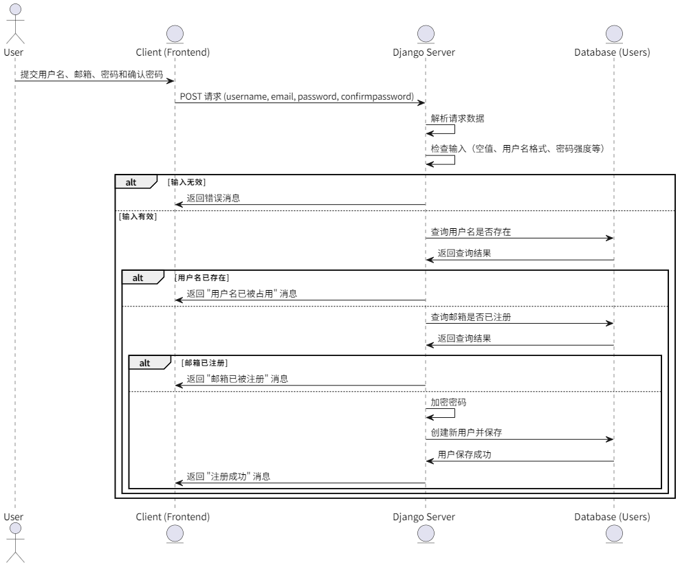

图4.2 注册时序图

#### 登录功能设计

登录时序图如图4.3所示，该登录功能的设计逻辑主要包括四个部分：请求处理、输入验证、用户验证和异常处理。首先，根据请求类型（GET 或 POST），服务器决定返回登录页面或处理用户提交的数据。对于 POST 请求，服务器首先解析请求体中的 JSON 数据，并验证用户名和密码是否为空。接着，通过数据库查询用户名是否存在，若不存在则返回错误信息。若用户存在，进一步验证密码是否正确，正确则登录成功并将用户 ID 存入 session，错误则返回密码错误信息。

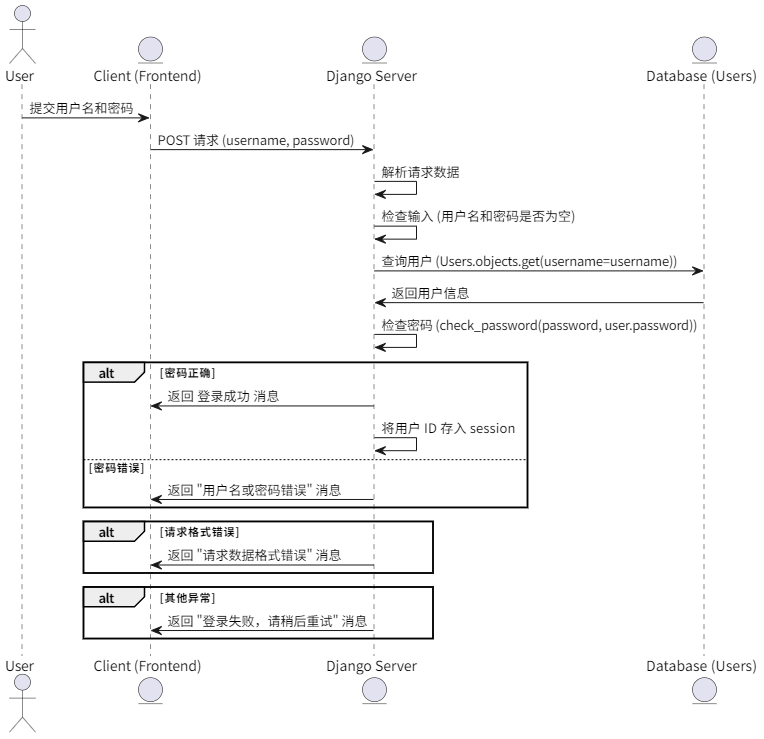

图4.3 登录时序图

#### 数据爬取功能设计

数据爬取时序图如图4.4所示，首先脚本一开始切换到当前脚本所在的目录，确保文件操作的路径一致。检查是否存在目标CSV文件，如果不存在则创建一个，并写入表头。通过requests库发送请求获取网页内容，使用lxml解析HTML。每次遍历不同菜系的分页链接，提取菜品的相关信息，如图片、标题、简介、作者、收藏和评论数量。

在爬取过程中，捕获每条数据的异常，确保不会因单条数据错误导致整个爬取流程中断。

针对不同的菜系（如云南、川菜、粤菜、鲁菜），通过分页不断抓取数据，直到达成每个菜系所有页面的爬取。

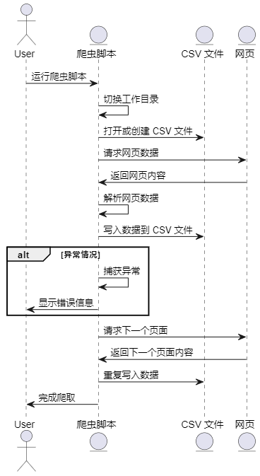

图4.4 数据爬取时序图

#### 数据分析功能设计

数据分析时序图如图4.5所示，首先通过连接数据库：通过pymysql连接到远程MySQL数据库，并通过cursor对象执行SQL查询。读取CSV文件中的美食简介字段，对其进行清洗（去除标点符号、多余空格），使用jieba进行中文分词，并去除停用词。对每种类型的美食，统计其简介中每个词的出现频率，如果某个词的出现次数大于5，则将其插入到wordanalysis表中。同时，对美食类型、评论数量、收藏数量进行统计分析，并插入相关的统计数据。在插入数据之前，清空相关的数据库表，以便存入最新的分析数据。将分析得到的词频数据和统计数据插入到数据库中的相应表中。

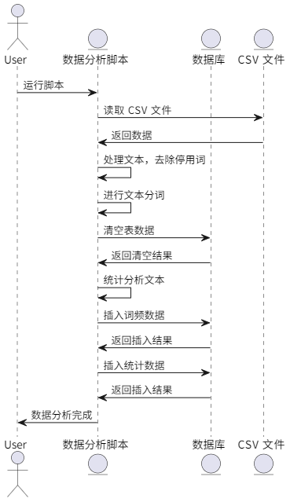

图4.5 数据分析时序图

#### 美食查询功能设计

美食查询时序图如图4.6所示，首先通过request.GET.get('search')获取前端传递的搜索关键词search_query。如果search_query存在，则通过Q对象对foodname或recommend字段进行模糊搜索，筛选出包含搜索关键词的菜品。使用Paginator进行分页，每页显示16个菜品。获取请求中的page参数，根据当前页码来获取相应的菜品数据。将分页后的菜品数据page_obj传递给search-list.html模板进行渲染，显示搜索结果。

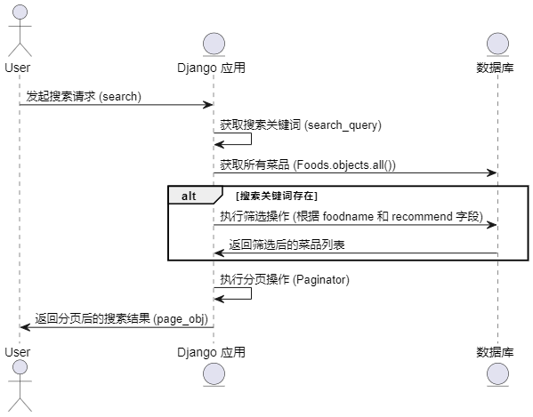

图4.6 美食查询时序图

#### 美食收藏功能设计

美食收藏时序图如图4.7所示，首先从request.session中获取当前用户的user_id，用于确认当前请求的用户。如果用户未登录，返回一个JSON响应，提示用户登录。根据传入的foodid从数据库中获取对应的食物对象。使用Wishlist.objects.create()方法将用户ID和食物对象创建一个新的心愿单项，保存到数据库中。成功添加心愿单项后，返回一个JSON响应，标明成功并附上消息。

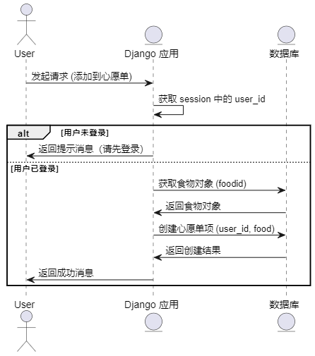

图4.7 美食收藏

#### 美食推荐功能设计

美食推荐时序图如图4.8所示，美食推荐设计过程通过用户的历史行为数据（如收藏、评论、浏览记录等）来生成个性化推荐。首先，用户登录系统后，系统收集相关的用户行为数据并进行预处理。接着，通过分析菜品的属性及用户的行为数据，计算菜品之间的相似度，通常采用余弦相似度或协同过滤算法。然后，系统根据用户的兴趣和偏好，从高相似度的菜品中推荐可能感兴趣的美食。最后，推荐数据会根据用户的新行为不断更新，以确保推荐结果的准确性和及时性，提升用户体验。

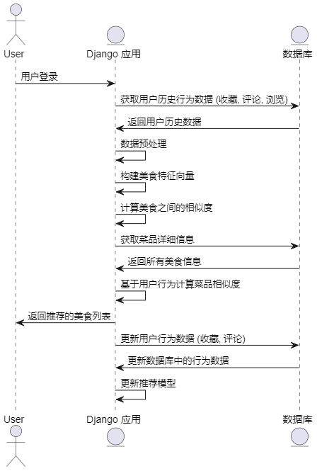

图4.8 美食推荐时序图

### 数据库设计

本系统共有8张表，分别存储用户数据，美食数据，评论数据，分类数据，数量分析数据，评论分析数据，收藏数据，词云分析数据，系统使用业务外键的形式进行表与表之间的关联，由于篇幅有限，展示部分表结构。

用户表主要存储用户数据，包含登录账号与加密后的登录密码，表结构如表4.1所示。

表4.1 用户表

<table>
<tr><td>字段名</td><td>数据类型</td><td>主键/允许空</td><td>字段含义</td></tr>
<tr><td>id</td><td>int</td><td>PRIMARY KEY</td><td>用户主键</td></tr>
<tr><td>username</td><td>varchar(255)</td><td>NOT NULL</td><td>用户名</td></tr>
<tr><td>password</td><td>varchar(255)</td><td>NOT NULL</td><td>密码（存储哈希值）</td></tr>
<tr><td>email</td><td>varchar(100)</td><td>UNIQUE, NOT NULL</td><td>用户邮箱</td></tr>
<tr><td>phone</td><td>varchar(11)</td><td>UNIQUE, NOT NULL</td><td>用户手机号</td></tr>
<tr><td>info</td><td>text</td><td>NULL</td><td>用户个性简介</td></tr>
<tr><td>face</td><td>varchar(255)</td><td>NULL</td><td>用户头像</td></tr>
<tr><td>addtime</td><td>datetime</td><td>NOT NULL</td><td>注册时间</td></tr>
</table>

食物表如表4.2所示，主要存储爬取的食物数据，并且菜品价格字段是后续推荐元素之一。

表4.2 foods 表

<table>
<tr><td>字段名</td><td>数据类型</td><td>主键/允许空</td><td>字段含义</td></tr>
<tr><td>id</td><td>int</td><td>PRIMARY KEY</td><td>菜品主键</td></tr>
<tr><td>foodname</td><td>varchar(70)</td><td>NOT NULL</td><td>菜品名称</td></tr>
<tr><td>foodtype</td><td>varchar(20)</td><td>NOT NULL</td><td>菜品类别</td></tr>
<tr><td>recommend</td><td>varchar(255)</td><td>NULL</td><td>菜品推荐语</td></tr>
<tr><td>imgurl</td><td>varchar(255)</td><td>NOT NULL</td><td>菜品图片 URL</td></tr>
<tr><td>price</td><td>decimal(5, 2)</td><td>NOT NULL</td><td>菜品价格</td></tr>
</table>

评论表表结构如表4.3所示，主要字段为uid与fid，一个关联用户表，一个关联美食表，以此形成业务外键联系。

表4.3 comments 表

<table>
<tr><td>字段名</td><td>数据类型</td><td>主键/允许空</td><td>字段含义</td></tr>
<tr><td>id</td><td>int</td><td>PRIMARY KEY</td><td>评论主键</td></tr>
<tr><td>uid</td><td>int</td><td>NOT NULL</td><td>用户 ID</td></tr>
<tr><td>fid</td><td>int</td><td>NOT NULL</td><td>菜品 ID</td></tr>
<tr><td>realname</td><td>varchar(11)</td><td>NOT NULL</td><td>评论者真实姓名</td></tr>
<tr><td>content</td><td>text</td><td>NOT NULL</td><td>评论内容</td></tr>
<tr><td>ctime</td><td>datetime</td><td>NULL</td><td>评论时间</td></tr>
</table>

收藏表表结构如表4.4所示，与评论表基本一致，主要字段为user_id与food_id，其中收藏表中的数据也是后续美食推荐模型元数据之一。

表4.4 收藏表

<table>
<tr><td>字段名</td><td>数据类型</td><td>主键/允许空</td><td>字段含义</td></tr>
<tr><td>id</td><td>int</td><td>PRIMARY KEY</td><td>主键</td></tr>
<tr><td>user_id</td><td>int</td><td>NOT NULL</td><td>用户 ID</td></tr>
<tr><td>food_id</td><td>int</td><td>NOT NULL</td><td>菜品 ID</td></tr>
<tr><td>added_time</td><td>datetime</td><td>NOT NULL</td><td>添加时间</td></tr>
</table>

数量分析表如表4.5所示，在数据分析功能中，数量分析结果将存入此表，后续用户在界面上查看数量分析结果，系统将直接读取此表数据，然后展示在界面上。

表4.5  数量分析表

<table>
<tr><td>字段名</td><td>数据类型</td><td>主键/允许空</td><td>字段含义</td></tr>
<tr><td>id</td><td>int</td><td>PRIMARY KEY</td><td>主键</td></tr>
<tr><td>cate_num</td><td>int</td><td>NOT NULL</td><td>菜品类型数量</td></tr>
<tr><td>cate_list</td><td>varchar(50)</td><td>NOT NULL</td><td>菜品类型名称</td></tr>
</table>

评论分析表结果如表4.6所示，存储来自数据分析功能中的评论分析数据。

表4.6 评论表

<table>
<tr><td>字段名</td><td>数据类型</td><td>主键/允许空</td><td>字段含义</td></tr>
<tr><td>id</td><td>int</td><td>PRIMARY KEY</td><td>主键</td></tr>
<tr><td>comment_num</td><td>int</td><td>NOT NULL</td><td>评论数量</td></tr>
<tr><td>comment_list</td><td>varchar(50)</td><td>NOT NULL</td><td>菜品评论的菜品名称</td></tr>
</table>

### 本章小结

本章主要阐述了系统架构设计；功能逻辑设计，数据库设计，确定逻辑实现过程。

## 系统实现

### 注册功能实现

图5.1 注册界面

系统注册界面如图5.1所示，前端实现过程首先通过HTML结构搭建了一个注册页面，包含用户名、邮箱、密码和确认密码输入框，以及一个提交按钮，在JavaScript部分，通过`addEventListener`监听了表单的提交事件，阻止了默认提交操作，使用fetch方法将表单数据以POST请求的形式发送给服务端。

服务端首先通过request.method == "POST"判断请求类型为POST，然后使用json.loads(request.body)解析前端传来的JSON数据。接着对用户名、密码、邮箱和确认密码进行一系列验证，包括检查字段是否为空、格式是否正确、密码强度和两次输入是否一致。若有任何验证失败，返回相应错误信息。接着，检查用户名和邮箱是否已存在于数据库中，所有检查通过后，使用make_password加密密码并创建新用户，并返回注册成功操作给前端，前端跳转界面到登录界面，完成注册。

### 登录功能实现

系统登录界面如图5.2所示，登录界面前端实现方式与注册一致，通过HTML搭建登录界面，实现登录表单，当用户所有输入完成后，服务端对用户输入的账号与密码当作参数去前台用户表查询，如果有查询的结果，则登入成功，前端在跳转到首页。

图5.2 登录界面

### 数据爬取功能实现

爬虫程序通过使用requests库请求网页内容，目标网站为：https://www.xiaochushuo.com。程序的目的是爬取不同类型的菜系信息，包括云南菜、川菜、粤菜和鲁菜等，并提取每道菜的相关数据。程序首先检查是否存在CSV文件，如果文件不存在，则创建文件并写入表头。数据爬取的过程中，程序针对每个菜系的多页进行遍历，利用`requests.get`获取网页内容，并通过`lxml`库的`XPath`解析方式提取所需数据。

数据包括菜品的图片URL、标题、简介、作者、收藏数量和评论数量等。这些数据通过xpath方法从HTML页面中提取，并且确保每个菜系的数据能够正确分类存储。为了提高数据的稳定性和完整性，程序在数据提取时添加了异常处理机制，若解析过程中发生错误，程序会捕获并打印错误信息。此外，在爬取到的数据存储过程中，为了确保数据的有效性，程序对部分内容进行了简单的数据清洗，如去除空值和格式错误的字段，最终将清洗后的数据写入CSV文件中进行存储，方便后续使用和分析。

for i in range(100):
 url2 = 'https://www.xiaochushuo.com/caipu/fenlei257352920/?page={}'.format(i+1)
 page_text = requests.get(url=url2, headers=headers).content.decode('utf-8')
 tree = etree.HTML(page_text)
 li_list = tree.xpath('//ul[@class="menu_list"][1]/li')
 for li in li_list:
 try:
 imgurl = li.xpath('.//a/div/img/@src')[0]
 title = li.xpath('.//div[@class="txt"]/a/h4/text()')[0]
 introduction = li.xpath('.//div[@class="txt"]/a/p/text()')[0]
 author = li.xpath('.//div[@class="writer"]/a/text()')[0]
 collect = li.xpath('.//div[@class="list_collect"]/span/text()')[0]
 praise = li.xpath('.//div[@class="praise"]/span/text()')[0]
 csv_writer.writerow([imgurl, title, introduction, author, collect, praise, '四川'])
 except Exception as e:
 print(f'本条爬取异常：{e}')

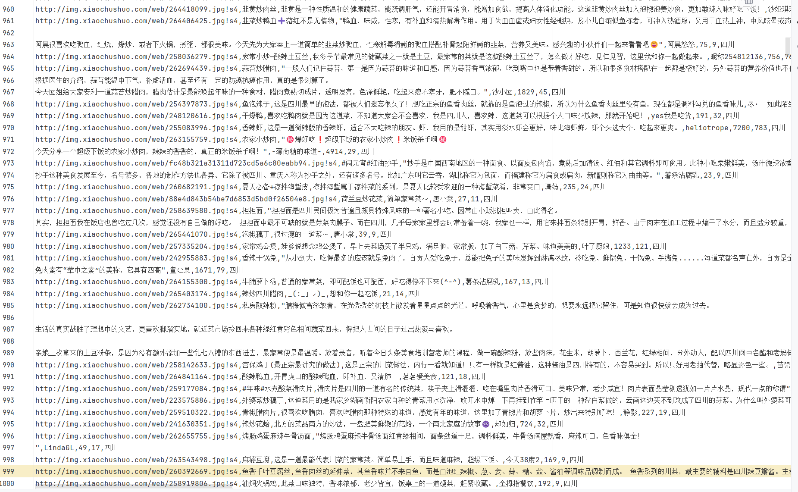

图5.3 爬虫实现结果

### 数据分析功能实现

首先通过连接数据库和读取CSV文件，提取并处理食品数据。它对每种食品的“简介”进行分词处理，并统计每个词语出现的频次，若词频大于5，则将结果插入数据库中的wordanalysis表。此外，还对数据进行了分类统计分析，包括按“类型”统计数量、评论数量前20名、收藏数量前20名，并将这些分析结果分别插入cateanalysis、commentanalysis和collectanalysis表中。

当用户进入数据分析界面，服务端通过analysis函数，获取上述步骤分析的结果，并传入给analysis.html，在analysis.html这个模板HTML中，通过getChartOption函数设定每种分析类型的图形状，然后展现给用户，关键代码如下所示。

cate_num = list(df['类型'].value_counts())
cate_list = list(df['类型'].value_counts().index)
insert_analysis_data(cursor, cate_num, cate_list, "cateanalysis", "cate_num", "cate_list")
insert_analysis_data(cursor, comment_num, comment_list, "commentanalysis", "comment_num", "comment_list")
insert_analysis_data(cursor, collect_num, collect_list, "collectanalysis", "collect_num", "collect_list")

实习效果如图5.4所示。

图5.4 数据分析实现效果1

### 美食查询功能实现

美食列表界面如图5.5所示，服务端查询出所有美食表的数据，这里通过分页查询，然后传给模板，模板在通过foreach的方式循环展示所有美食，用户可以进行美食分类查询与美食关键字查询，当用户进行这种操作时，服务端获取用户查询参数，并当作SQL语句查询参数，查询与用户输入有关的数据，然后渲染展示给用户。

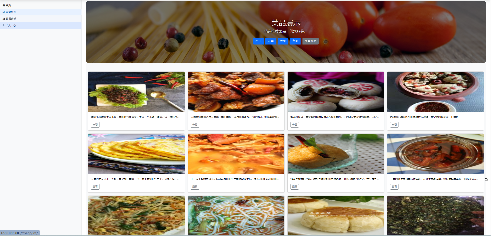

图5.5 美食查询

### 美食收藏与评论实现

美食详情界面如图5.6所示，用户点击详情，界面跳转美食详情界面，通过美食主键，获取美食详细数据，在通过模板渲染美食详细数据，然后通过美食与评论表与收藏表之间的业务外检联系，查询该美食的评论数据与收藏数据，并通过收藏表与用户表之间的业务外键关系，判断该用户是否收藏该美食。

图5.7 美食详情界面

当用户点击收藏按钮，前端请求add_to_wishlist/1/接口，服务端通过Session获取用户主键，通过请求地址中的参数获取美食主键，并将输入存入收藏表中，返回收藏成功给前端，前端通过aleat函数向用户展示收藏成功提醒，如图5.8所示。

图5.8 美食收藏界面

用户可以在下方评论表单中，输入个人信息与评论内容，实现对美食的评论，如图5.9所示。

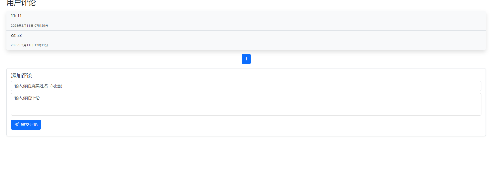

图5.9 美食评论

### 美食推荐功能实现

美食推荐界面如图5.10所示，使用到了协同过滤算法，首先，通过get_user_favorites获取用户收藏的菜品，并从数据库中获取所有菜品的详细信息。然后，使用construct_matrix方法为每个菜品构建一个包含价格和分类的矩阵。对于数值型数据（如价格），我们使用pivot_table来处理；对于非数值型数据（如菜品类别），使用get_dummies将其转换为数值矩阵。接着，我们将所有菜品的价格矩阵和分类矩阵合并成一个综合矩阵，以便后续的相似度计算。

在相似度计算部分，我们使用cosine_similarity方法计算所有菜品之间的相似度矩阵。通过用户收藏的菜品矩阵，我们从相似度矩阵中提取出与这些菜品相似的其他菜品，并计算出相似度得分。最后，根据相似度得分对所有菜品进行排序，排除用户已经收藏的菜品后，返回评分最高的前N个推荐菜品。为了支持分页功能，推荐结果通过Paginator进行分页，每页显示16个菜品。最终，在前端页面上呈现推荐的菜品列表以及每个菜品的相似度得分，提供用户更好的个性化推荐体验，主要代码如下所示：

# 获取用户收藏的菜品
favorite_foods = get_user_favorites(user_id)
# 获取所有菜品
all_foods = get_all_foods()
# 构建所有菜品的矩阵
all_food_matrix = construct_matrix(all_foods)
# 构建用户收藏的菜品矩阵
favorite_food_matrix = construct_matrix(favorite_foods)
# 先处理数值型数据
price_matrix = pd.pivot_table(all_food_matrix, index='food_id', values='price', aggfunc='mean').fillna(0)
# 确保价格矩阵是浮动类型数据
price_matrix = price_matrix.astype(float)
# 处理非数值型数据
category_matrix pd.get_dummies(all_food_matrix.set_index('food_id')['foodtype']).groupby('food_id').mean()
# 确保分类矩阵是浮动类型数据
category_matrix = category_matrix.astype(float)
# 合并数值型和非数值型数据
# 使用 'inner' join 以确保只有共同的 food_id 被保留
all_food_matrix_combined = pd.concat([price_matrix, category_matrix], axis=1, join='inner')
# 确保所有值都是数值型
all_food_matrix_combined = all_food_matrix_combined.apply(pd.to_numeric, errors='coerce').fillna(0)
# 获取用户收藏的菜品矩阵
favorite_food_matrix_combined = pd.concat(
 [pd.pivot_table(favorite_food_matrix, index='food_id', values='price', aggfunc='mean').fillna(0), pd.get_dummies(favorite_food_matrix.set_index('food_id')['foodtype']).groupby('food_id').mean()], axis=1,
 join='inner')
favorite_food_matrix_combined = favorite_food_matrix_combined.apply(pd.to_numeric, errors='coerce').fillna(0)
# 计算所有菜品的相似度矩阵
food_similarity = cosine_similarity(all_food_matrix_combined)
# 将相似度矩阵转为 DataFrame 以便处理
food_similarity_df = pd.DataFrame(food_similarity, index=all_food_matrix_combined.index,
 columns=all_food_matrix_combined.index)
# 获取当前用户收藏菜品的相似度得分
favorite_food_ids = favorite_food_matrix_combined.index.tolist()
similar_scores = food_similarity_df.loc[favorite_food_ids].mean(axis=0)
# 将所有菜品的相似度得分转化为 DataFrame
scores_df = pd.DataFrame(similar_scores, columns=['score'])
# 排除用户已经收藏的菜品
scores_df = scores_df[~scores_df.index.isin(favorite_food_ids)]
# 获取评分最高的前 N 个菜品的 food_id
top_food_ids = scores_df.sort_values(by='score', ascending=False).head(top_n).index

图5.10 推荐实现

### 后台登录实现

如图 5.11 所示，系统后台登录界面基于 Django 框架内置的 Admin 管理模块构建。通过执行 createsuperuser 命令，可以创建具有最高权限的管理员账户，从而允许用户以账号和密码的方式进入后台系统。管理员在登录界面输入相应的凭据后，即可成功访问后台管理功能。

图5.11 后台登录界面

### 后台管理实现

后台登录界面如图5.12所示，在 admin.py 文件中，将需要管理的实体类注册（注入）到 Django Admin 后台系统中，例如前台用户实体 User、美食实体 Foods 以及评论实体 Comment。通过将这些模型类使用 admin.site.register() 方法进行注册，Django 会自动根据模型中定义的字段结构，在后台界面中生成对应的数据管理页面，支持对实体数据的增、删、改、查等操作。

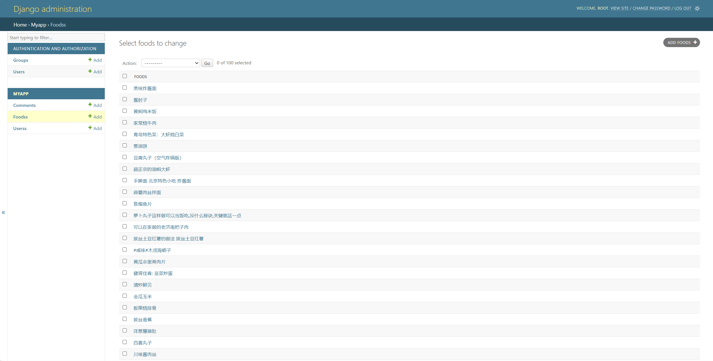

图5.12 后台管理界面

### 本章小结

本章详细阐述了系统的实现过程，包括登注册，登录，数据爬取，数据分析，美食查询，美食收藏评论，美食推荐功能。

## 系统测试

### 测试环境与方法

系统测试环境如下所示：

操作系统：Windows11；

编译器：Pycharm；

Python环境：3.11；

数据库版本：阿里云RDS MySQL数据库 8.0.26

系统测试方法采用黑盒测试方法，重点测试系统的主要功能模块，包括注册、登录、数据爬取、收藏与评论、美食推荐等功能。黑盒测试方法侧重于测试系统的功能是否满足需求，而不关心其内部实现。

### 测试用例

注册测试用例如表6.1所示，主要测试用户什么都不输入是否可以进行账号注册，用户输入重复的名称与邮箱是否可以注册。

表6.1 注册测试用例表

<table>
<tr><td>名称</td><td colspan="3">注册测试用例</td></tr>
<tr><td>步骤</td><td>步骤</td><td colspan="2">测试步骤</td></tr>
<tr><td></td><td>1</td><td colspan="2">什么不输入进行注册</td></tr>
<tr><td></td><td>2</td><td colspan="2">输入过短的密码进行注册</td></tr>
<tr><td></td><td>3</td><td colspan="2">输入重复的账号名称：admins，进行注册</td></tr>
<tr><td></td><td>4</td><td colspan="2">输入符合要求的数据，进行注册</td></tr>
<tr><td colspan="4">预期结果与测试结果</td></tr>
<tr><td>结果</td><td>1a</td><td>提示：所有字段都是必需的</td><td>通过</td></tr>
<tr><td></td><td>2a</td><td>提示密码长度至少为8位</td><td>通过</td></tr>
<tr><td></td><td>3a</td><td>提示账号名称重复</td><td>通过</td></tr>
<tr><td></td><td>4a</td><td>注册成功，界面跳转到登录界面</td><td>通过</td></tr>
</table>

登录测试用例如表6.2所示，主要测试系统是否对账号与密码进行了校验，登录成功是否可以将用户主键存入Session中。

表6.2 登录测试用例表

<table>
<tr><td>名称</td><td colspan="3">登录测试用例</td></tr>
<tr><td>步骤</td><td>步骤</td><td colspan="2">步骤与预期结果</td></tr>
<tr><td></td><td>1</td><td colspan="2">进入登录界面，什么都不输入，点击登录</td></tr>
<tr><td></td><td>2</td><td colspan="2">输入错误账号，点击登录</td></tr>
<tr><td></td><td>3</td><td colspan="2">输入错误密码，点击登录</td></tr>
<tr><td></td><td>4</td><td colspan="2">输入正确的账号与密码，点击登录</td></tr>
<tr><td colspan="4">预期结果与测试结果</td></tr>
<tr><td>结果</td><td>1a</td><td>提示用户名和密码不能为空</td><td>通过</td></tr>
<tr><td></td><td>2a</td><td>提示用户名不存在</td><td>通过</td></tr>
<tr><td></td><td>3a</td><td>提示用户名或密码错误</td><td>通过</td></tr>
<tr><td></td><td>4a</td><td>登录成功，Session中存在用户主键，界面跳转首页</td><td>通过</td></tr>
</table>

数据爬取测试用例表如表6.3所示，主要测试了数据爬取，数据清洗，数据分析这一个流程的功能是否正常。

表6.3 数据爬取测试用例表

<table>
<tr><td>名称</td><td colspan="3">数据爬取</td></tr>
<tr><td>步骤</td><td>步骤</td><td colspan="2">测试步骤</td></tr>
<tr><td></td><td>1</td><td colspan="2">启动数据爬取程序</td></tr>
<tr><td></td><td>2</td><td colspan="2">启动数据清洗程序</td></tr>
<tr><td></td><td>3</td><td colspan="2">启动数据清洗程序</td></tr>
<tr><td></td><td>4</td><td colspan="2">登录后，进入数据分析界面</td></tr>
<tr><td colspan="4">预期结果与测试结果</td></tr>
<tr><td>结果</td><td>1a</td><td>数据正在获取，且csv文件有最新获取的数据，美食表与美食分类表有数据存入</td><td>通过</td></tr>
<tr><td></td><td>2a</td><td>数据清洗成功</td><td>通过</td></tr>
<tr><td></td><td>3a</td><td>数据分析成功，且数据分析表有数据存入</td><td>通过</td></tr>
<tr><td></td><td>4a</td><td>数据分析界面进入成功，选择分析类型，Echrats渲染的图成功</td><td>通过</td></tr>
</table>

收藏与评论测试用例如表6.4所示，主要测试用户可以收藏美食，是否可以对美食进行评论。

表6.4 收藏与评论测试用例表

<table>
<tr><td>名称</td><td colspan="3">收藏与评论</td></tr>
<tr><td>步骤</td><td>步骤</td><td colspan="2">测试步骤</td></tr>
<tr><td></td><td>1</td><td colspan="2">未登录用户进入系统</td></tr>
<tr><td></td><td>2</td><td colspan="2">登录后进入系统，搜索美食，进行美食收藏操作</td></tr>
<tr><td></td><td>3</td><td colspan="2">对步骤2的美食再次进行收藏操作</td></tr>
<tr><td></td><td>4</td><td colspan="2">评论步骤2的美食</td></tr>
<tr><td colspan="4">预期结果与测试结果</td></tr>
<tr><td>结果</td><td>1a</td><td>跳转登录界面，提示请登录</td><td>通过</td></tr>
<tr><td></td><td>2a</td><td>收藏成功，界面刷新</td><td>通过</td></tr>
<tr><td></td><td>3a</td><td>取消收藏成功，界面刷新</td><td>通过</td></tr>
<tr><td></td><td>4a</td><td>评论成功，界面刷新，展示刚评论的内容</td><td>通过</td></tr>
</table>

美食推荐功能测试用例如表6.5所示，美食推荐功能主要测试系统是否可以根据用户收藏的美食与美食的分类和价格，构建矩阵，并与数据库中的美食进行比较，来推荐相似的其他美食给用户。

表6.5 美食推荐功能测试用例

<table>
<tr><td>名称</td><td colspan="3">美食推荐功能</td></tr>
<tr><td>步骤</td><td>步骤</td><td colspan="2">测试步骤</td></tr>
<tr><td></td><td>1</td><td colspan="2">未登录用户进入美食推荐界面</td></tr>
<tr><td></td><td>2</td><td colspan="2">登录用户进入美食推荐界面</td></tr>
<tr><td colspan="4">预期结果与测试结果</td></tr>
<tr><td>结果</td><td>1a</td><td>跳转登录界面，提示请登录</td><td>通过</td></tr>
<tr><td></td><td>2a</td><td>界面展示推荐的美食，并展示每个美食的相似度</td><td>通过</td></tr>
</table>

## 结论

通过本美食推荐平台的实现，我们成功地运用了协同过滤算法，结合用户的历史行为和相似度，构建了一个个性化的推荐系统。该系统通过分析用户的兴趣和偏好，能够为用户提供精准的美食推荐服务，从而提高了用户的体验和满意度。平台的主要功能包括用户登录与注册、美食搜索与推荐、个人信息管理、美食收藏与评论以及数据分析，涵盖了美食推荐系统的基本需求，并为用户提供了一个全面且便捷的使用体验。

系统的技术架构采用了Python编程语言和Django框架，后端服务稳定高效，能够支持大规模的数据处理和快速响应用户请求。数据库使用MySQL进行数据存储，确保了数据的持久性和一致性；前端页面采用了Bootstrap框架，使得用户界面简洁明了，易于操作。通过使用Pandas库对美食数据进行分析，结合爬虫技术获取互联网上最新的美食信息，丰富了推荐算法的数据来源，使得推荐更加准确和多样化。

协同过滤算法作为本系统的核心推荐算法，通过分析用户与用户之间的相似性以及物品与物品之间的相似性，能够精准地挖掘用户的潜在需求。经过测试，系统的推荐效果得到了用户的高度评价，推荐的准确性和满意度均有显著提升。用户不仅能够得到基于历史行为的个性化推荐，还能够通过收藏与评论功能进一步影响推荐内容，形成良性循环。

本系统为美食推荐领域提供了一种有效的解决方案，不仅提升了用户体验，也为进一步优化推荐算法提供了丰富的实践数据和经验。在未来的发展中，系统可以通过引入更多的算法，如基于内容的推荐和深度学习算法，进一步提高推荐的精准度和系统的智能化水平。
